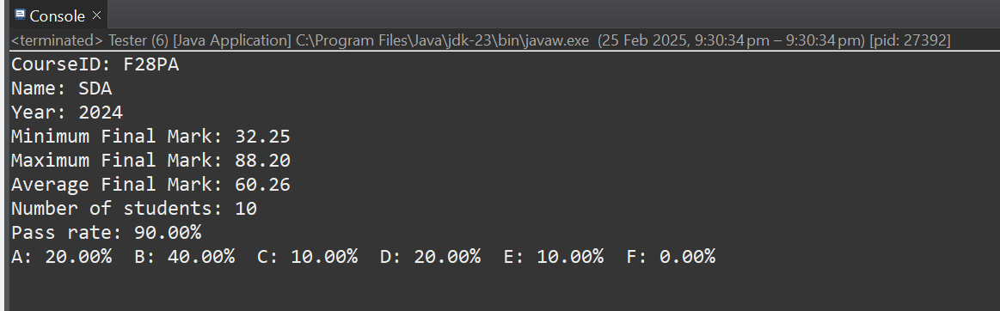
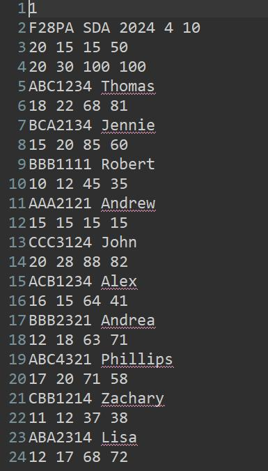

# 📚 Student Assessment Processing System

## 🛠️ Technical Implementation

The system is built using principles of Object-Oriented Programming (OOP) to ensure the modularity and scalability of student and course records.

- <b>Robust Validation:</b> Implements a multi-stage validation pipeline that ensures assessment weights total 100% and marks remain within defined thresholds before processing
- <b>Error Resilience:</b> Features comprehensive Exception Handling to catch and log malformed input data, missing fields or invalid file formats, preventing system crashes during large-batch processing

## 📈 Analytical Capabilities

- <b>Statistical Reporting:</b> Generates comprehensive performance metrics, including pass/fail rates, mean scores and grade distributions.
- <b>Dynamic Storage:</b> Leverages ArrayLists for flexible memory management, allowing the system to scale based on the number of student entries in the source file.

## 🚀 Usage

<b>Input Format</b>
The system expects a .txt file formatted as follows:   

